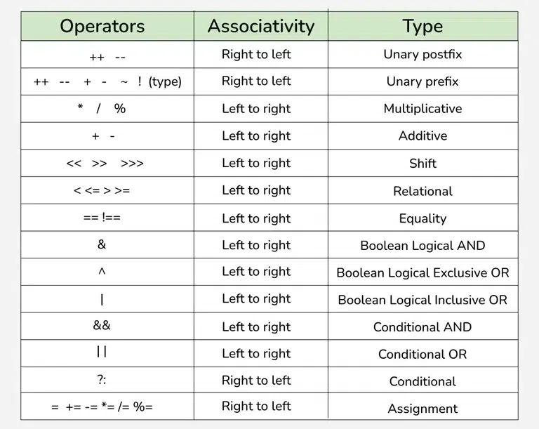

There is often confusion when it comes to hybrid equations which are equations having multiple operators. The problem is which part to solve first. There is a golden rule to follow in these situations. If the operators have different precedence, solve the higher precedence first. If they have the same precedence, solve according to associativity, that is, either from right to left or from left to right. The explanation of the below program is well written in comments within the program itself.

Advantages of Operators
Operators in Java provide a concise and readable way to perform complex calculations and logical operations.
Operators in Java save time by reducing the amount of code required to perform certain tasks.
Using operators can improve performance because they are often implemented at the hardware level, making them faster than equivalent Java code.

Disadvantages of Operators
Operators in Java have a defined precedence, which can lead to unexpected results if not used properly.
Java performs implicit type conversions when using operators, which can lead to unexpected results or errors if not used properly.

Common Mistakes to Avoid
The common mistakes that can occur when working with Java Operators are listed below:
Confusing == with =: Using == for assignment instead of = for equality check leads to logical errors.
Incorrect Use of Floating Point Comparison: Comparing floating point numbers using == can lead to unexpected results due to precision issues.
Integer Division Confusion: Dividing two integers will result in integer division (truncating the result).
Overusing + for String Concatenation in Loops: Using + for concatenating strings in loops leads to performance issues because it creates new string objects on each iteration.
